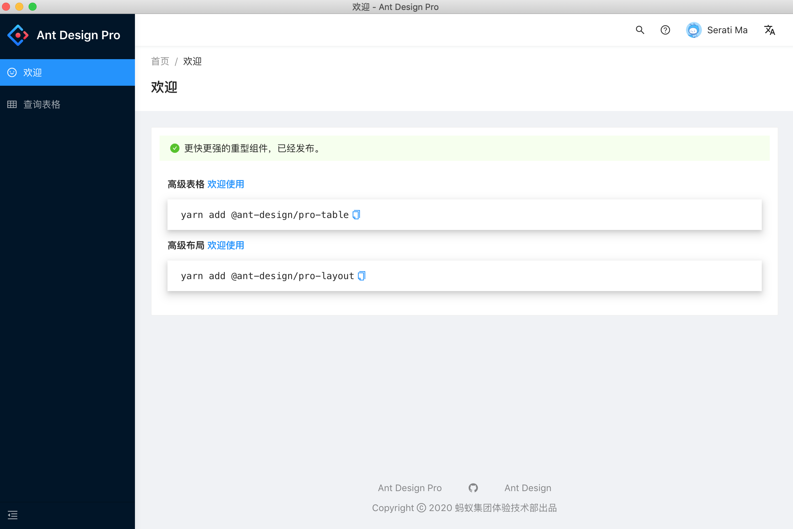
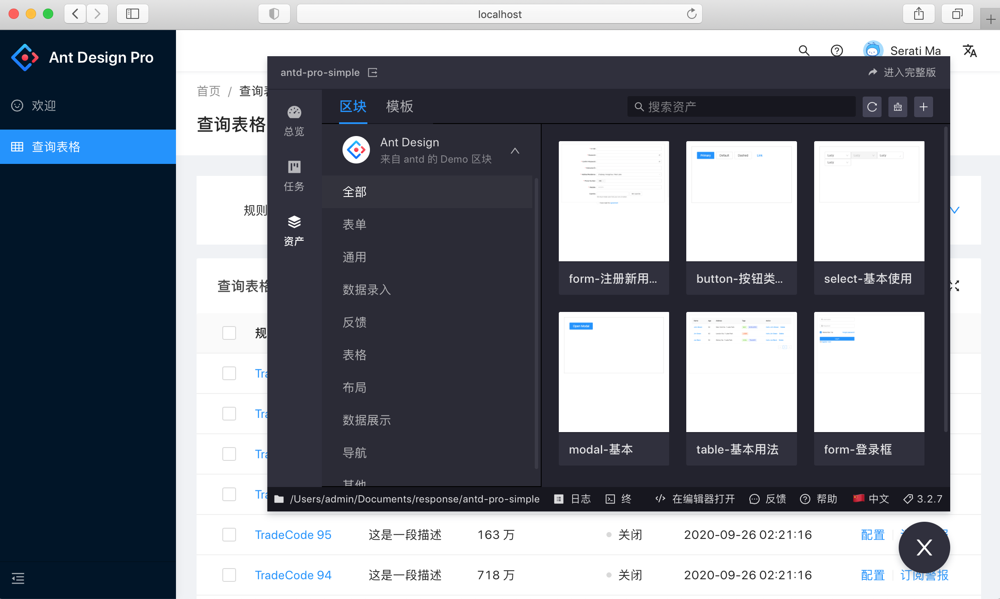

# electron-umi-antd-pro




### 基于 umijs + electron + ant-design-pro 的模板

## 支持

- 支持热更新
- 同时支持 web 打包和桌面应用打包
- 支持桌面应用打包 mac、linux、win
- 支持 umi-ui 自动添加组件
- ant-design-pro@^4.x

## 项目结构

```ssh
.
|-- build
|   |-- icon.icns                         # 打包后程序图标 MacOS
|   |-- icon.ico                          # 打包后程序图标 Windows
|   |-- webpack.base.config.js            # electron-webpack 基础配置
|   |-- webpack.main.config.js            # electron-webpack 开发配置
|   `-- webpack.main.prod.config.js       # electron-webpack 正式配置
|-- config
|   `-- config.js                         # umijs配置
|-- main
|   `-- main.js                           # 主程序入口
|-- dist                                  # 项目编译输出目录
|   |-- main                              # 主程序编译目录
|   `-- renderer                          # 页面编译目录
|-- mock                                  # 本地模拟数据
|-- public                                # 静态资源目录
|   `-- renderer.js                       # 如果需要引用node的api，需要在这个js里面提前引入
|-- release                               # 打包输出目录
|-- src                                   # 开发目录
│   |-- assets                            # 本地静态资源
│   |-- components                        # 业务通用组件
│   |-- e2e                               # 集成测试用例
│   |-- layouts                           # 通用布局
│   |-- models                            # 全局 dva model
│   |-- pages                             # 业务页面入口和常用模板
│   |-- services                          # 后台接口服务
│   |-- utils                             # 工具库
│   |-- locales                           # 国际化资源
│   |-- global.less                       # 全局样式
│   `-- global.ts                         # 全局 JS
|-- tests                                 # 测试工具
|-- package.json                          # 项目依赖以及打包配置
`-- README.md                             # 项目说明文档
```

## 环境搭建

### 安装

然后通过 yarn 下载依赖

```javascript
  $ yarn
```

### 开发

首先通过以下命令启动渲染进程(默认端口：8000)

```javascript
  $ yarn start:renderer
```

然后启动主进程

```javascript
  $ yarn start:main
```

### 如何使用 node 的 api

需要在 /public/renderer.js 中引入相关的 api，例如 electron 依赖

### 打包

```javascript
  $ yarn build            // 打包mwl桌面应用
  $ yarn build:renderer   // 打包web版本
```

### 打包配置说明 [`package.json`](./package.json)

[electron-builder-参数参考](https://www.electron.build/configuration/configuration)

[category-Mac 分类参考](https://developer.apple.com/library/ios/documentation/General/Reference/InfoPlistKeyReference/Articles/LaunchServicesKeys.html#//apple_ref/doc/uid/TP40009250-SW8)

### 💿 下载的 electron 目录

https://npm.taobao.org/mirrors/electron

Linux: \$XDG_CACHE_HOME or ~/.cache/electron/

MacOS: ~/Library/Caches/electron/

Windows: \$LOCALAPPDATA/electron/Cache or ~/AppData/Local/electron/Cache/

### 💿 下载的 electron-builder 目录

https://github.com/electron-userland/electron-builder-binaries/releases

同上的缓存路径 {cache_path}/electron-builder/

appimage fpm linux nsis snap winCodeSign wine

---

### 🔧 npm/yarn 配置命令

```bash

# 第一次安装需要的依赖
npm install --save-dev electron-rebuild
brew install pkg-config cairo pango libpng jpeg giflib librsvg
```
